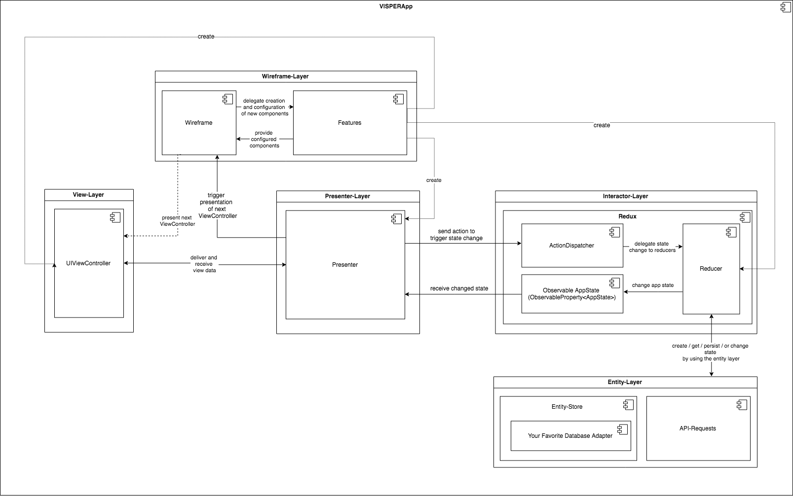

# VISPER

[](http://cocoapods.org/pods/VISPER)
[](http://cocoapods.org/pods/VISPER)
[](http://cocoapods.org/pods/VISPER)

VISPER is a component based library, which helps you to develop modular apps based on the VIPER Pattern.
VISPER contains of several components to create a flexibel architecture for your iOS-app. It contains of 3 main components.

The most general is the [App](#app) protocol, which helps you to compose your app of seperated modules called [Features](#features-and-featureobserver). Each  Feature creates and configures a distinct part of application.  VISPER provides you with the  [Wireframe](#wireframe) , since the navigation between view controllers is an important aspect of your application, which should be modelt explicitly without coupling your different UIViewControllers.  The [Wireframe](#wireframe) a powerful router component, which defines a defined workflow for creating, presenting and navigation between ViewControllers without requiering a view controller to know about  the implementation of the next presented view controller. An other important concern when creating a new app is state management. In an VISPER-App this is typically done by a  [Redux](#visper-redux) Object which lives in the interactor layer and provides a complete Redux-Architecture to manage your appstate and it's transitions.

- [VISPER](#visper)
  * [Getting started](#getting-started)
    + [App](#app)
    + [Features and FeatureObserver](#features-and-featureobserver)
    + [Wireframe](#wireframe)
    + [VISPER-Redux](#visper-redux)
      - [State](#state)
      - [AppReducer](#appreducer)
      - [ReduxApp](#reduxapp)
      - [Changing state](#changing-state)
      - [Reducer](#reducer)
        * [ReduceFuntion](#reducefuntion)
        * [FunctionalReducer](#functionalreducer)
        * [ActionReducerType](#actionreducertype)
        * [AsyncActionReducerType](#asyncactionreducertype)
      - [LogicFeature](#logicfeature)
      - [Observing state change](#observing-state-change)
  * [Complete list of all available VISPER-Components](#complete-list-of-all-available-visper-components)
  
## Architecture
  
The architecture of an typical app, build with VISPER is shown in this image.
Well ok we now that looks a bit complicated.

We created a seperate article to dig deeper into this topic. You can find it [here](docs/Architecture.md). 
  


## Getting started 

### App

The core component of your VISPER application is an instance of the [App](https://rawgit.com/barteljan/VISPER/master/docs/VISPER-Core/Protocols/App.html)
protocol, which allows you to configure your application by a [Feature](https://rawgit.com/barteljan/VISPER/master/docs/VISPER-Core/Protocols.html#/s:11VISPER_Core7FeatureP) which represents a distinct functionality of your app and 
configures all VISPER components used by it.

The definition of the [App](https://rawgit.com/barteljan/VISPER/master/docs/VISPER-Core/Protocols/App.html) protocol is quite simple:

````swift
public protocol App {

    /// Add a feature to your application
    ///
    /// - Parameter feature: your feature
    /// - Throws: throws errors thrown by your feature observers
    ///
    /// - note: A Feature is an empty protocol representing a distinct funtionality of your application.
    ///         It will be provided to all FeatureObservers after addition to configure and connect it to
    ///         your application and your remaining features. Have look at LogicFeature and LogicFeatureObserver for an example.
    func add(feature: Feature) throws

    /// Add an observer to configure your application after adding a feature.
    /// Have look at LogicFeature and LogicFeatureObserver for an example.
    ///
    /// - Parameter featureObserver: an object observing feature addition
    func add(featureObserver: FeatureObserver)

}
```` 

### Features and FeatureObserver

You can basicly add some [FeatureObservers](https://rawgit.com/barteljan/VISPER/master/docs/VISPER-Core/Protocols/FeatureObserver.html) and [Features](https://rawgit.com/barteljan/VISPER/master/docs/VISPER-Core/Protocols.html#/s:11VISPER_Core7FeatureP) to an [App](https://rawgit.com/barteljan/VISPER/master/docs/VISPER-Core/Protocols/App.html).

A [FeatureObserver](https://rawgit.com/barteljan/VISPER/master/docs/VISPER-Core/Protocols/FeatureObserver.html) will be called whenever a [Feature](https://rawgit.com/barteljan/VISPER/master/docs/VISPER-Core/Protocols.html#/s:11VISPER_Core7FeatureP) is added and is responsible for configuring your VISPER components to provide the functionality implemented by your [Feature](https://rawgit.com/barteljan/VISPER/master/docs/VISPER-Core/Protocols.html#/s:11VISPER_Core7FeatureP).

Many VISPER Components implement their own subtypes of [App](https://rawgit.com/barteljan/VISPER/master/docs/VISPER-Core/Protocols/App.html), [Feature](https://rawgit.com/barteljan/VISPER/master/docs/VISPER-Core/Protocols.html#/s:11VISPER_Core7FeatureP) and [FeatureObserver](https://rawgit.com/barteljan/VISPER/master/docs/VISPER-Core/Protocols/FeatureObserver.html).

* [VISPER-Wireframe](https://rawgit.com/barteljan/VISPER/master/docs/VISPER-Wireframe/index.html) provides you with: 
* [WireframeApp](https://rawgit.com/barteljan/VISPER/master/docs/VISPER-Wireframe/Protocols/WireframeApp.html) 
* [ViewFeature](https://rawgit.com/barteljan/VISPER/master/docs/VISPER-Wireframe/Protocols/ViewFeature.html) 
* [PresenterFeature](https://rawgit.com/barteljan/VISPER/master/docs/VISPER-Wireframe/Protocols/PresenterFeature.html)
* [WireframeFeatureObserver](https://rawgit.com/barteljan/VISPER/master/docs/VISPER-Wireframe/Protocols/WireframeFeatureObserver.html)
* [ViewFeatureObserver](https://rawgit.com/barteljan/VISPER/master/docs/VISPER-Wireframe/Structs/ViewFeatureObserver.html) 
* [PresenterFeatureObserver](https://rawgit.com/barteljan/VISPER/master/docs/VISPER-Wireframe/Structs/PresenterFeatureObserver.html).

* [VISPER-Redux](https://rawgit.com/barteljan/VISPER/master/docs/VISPER-Redux/index.html) provides you with: 
* [ReduxApp](https://rawgit.com/barteljan/VISPER/master/docs/VISPER-Redux/Protocols/ReduxApp.html) 
* [LogicFeature](https://rawgit.com/barteljan/VISPER/master/docs/VISPER-Redux/Protocols/LogicFeature.html) 
* [LogicFeatureObserver](https://rawgit.com/barteljan/VISPER/master/docs/VISPER-Redux/Structs/LogicFeatureObserver.html).

[VISPER-Swift](https://rawgit.com/barteljan/VISPER/master/docs/VISPER-Swift/index.html) provides you with a [VISPERApp](https://rawgit.com/barteljan/VISPER/master/docs/VISPER-Swift/Classes/VISPERApp.html) which combines all characteristics of a [WireframeApp](https://rawgit.com/barteljan/VISPER/master/docs/VISPER-Wireframe/Protocols/WireframeApp.html) and a [ReduxApp](https://rawgit.com/barteljan/VISPER/master/docs/VISPER-Redux/Protocols/ReduxApp.html) and is used in the most Apps build with the VISPER-Framework.

### Wireframe

The [Wireframe](https://rawgit.com/barteljan/VISPER/master/docs/VISPER-Core/Protocols/Wireframe.html) manages the lifecycle of UIViewController in an VISPER-Application. 
It is used to create controllers and to route from one controller to an other. It seperates the ViewController presentation and creation logic from the UIViewController itself.

The [VISPER-Wireframe](https://rawgit.com/barteljan/VISPER/master/docs/VISPER-Wireframe/index.html) component contains an implementation of the [Wireframe](https://rawgit.com/barteljan/VISPER/master/docs/VISPER-Core/Protocols/Wireframe.html)-Protocol.  

You can use the [DefaultWireframeAppFactory](https://rawgit.com/barteljan/VISPER/master/docs/VISPER-Wireframe/Classes/DefaultWireframeAppFactory.html) to create a [WireframeApp](https://rawgit.com/barteljan/VISPER/master/docs/VISPER-Wireframe/Protocols/WireframeApp.html) with a default configuration:

````swift
let navigationController = UINavigationController()
let factory = DefaultWireframeAppFactory()
let wireframeApp = factory.makeApp()
wireframeApp.add(controllerToNavigate: navigationController)
````

if you want to create a [Wireframe](https://rawgit.com/barteljan/VISPER/master/docs/VISPER-Core/Protocols/Wireframe.html) without creating a [WireframeApp](https://rawgit.com/barteljan/VISPER/master/docs/VISPER-Wireframe/Protocols/WireframeApp.html) use the [WireframeFactory](https://rawgit.com/barteljan/VISPER/master/docs/VISPER-Wireframe/Classes/WireframeFactory.html).

````swift
let factory = WireframeFactory()
let wireframe = factory.makeWireframe()
````

Now create a ViewFeature which provides a ViewController and some RoutingOptions, to define how the controller will be presented, to your wireframe.

````swift
class ExampleViewFeature: ViewFeature {

    var routePattern: String = "/exampleView"
    var priority: Int = 0

    //controller will be pushed on current active navigation controller 
    func makeOption(routeResult: RouteResult) -> RoutingOption {
        return DefaultRoutingOptionPush()
    }

    func makeController(routeResult: RouteResult) throws -> UIViewController {
        let controller = UIViewController()
        return controller
    }
}
````

Add it to your [WireframeApp](https://rawgit.com/barteljan/VISPER/master/docs/VISPER-Wireframe/Protocols/WireframeApp.html)

````swift
let feature = ExampleFeature()
wireframeApp.add(feature: feature)
````

or to your [Wireframe](https://rawgit.com/barteljan/VISPER/master/docs/VISPER-Core/Protocols/Wireframe.html)

````swift
let feature = ExampleFeature()
wireframe.add(controllerProvider: feature, priority: feature.priority)
wireframe.add(optionProvider: feature, priority: feature.priority)
try wireframe.add(routePattern: feature.routePattern)
````

You can now route to the controller provided by the ExampleFeature:
````swift
try wireframe.route(url: URL(string: "/exampleView")!)
````


[Here ist a full example using VISPER with a wireframe](docs/Wireframe-Example.md)

### VISPER-Redux

[VISPER-Redux](https://rawgit.com/barteljan/VISPER/master/docs/VISPER-Redux/index.html) is an implementation of the redux-architecture in swift. 

It provides you with an app architecture to tackle the problem 
of distributed app state and state changes. It is the implementaion 
of the interactor layer in many Apps based on the VISPER Framework.

If you want to learn more about redux, have a look at the following tutorials and documentations:

* [A cartoon guide to Flux](https://code-cartoons.com/a-cartoon-guide-to-flux-6157355ab207)
* [A cartoon Intro to Redux](https://code-cartoons.com/a-cartoon-intro-to-redux-3afb775501a6)
* [redux.js Documentation](http://redux.js.org/docs/introduction/)

A comprehensive introduction about [VISPER-Redux](https://rawgit.com/barteljan/VISPER/master/docs/VISPER-Redux/index.html) can be found [here](https://rawgit.com/barteljan/VISPER/master/docs/VISPER-Redux/index.html).

#### State

[VISPER-Redux](https://rawgit.com/barteljan/VISPER/master/docs/VISPER-Redux/index.html) stores the complete state of your app in a central struct to create a transparent representation of the current state of your different app components.

A typical composite app state for an app to manage your todos in the next week might look like that: 

```swift
struct AppState {
    var userState: UserState
    var todoListState: TodoListState
    var imprintState: ImprintState
}
```

with some composite sub states:

```swift
    struct UserState {
    var userName: String
    var isAuthenticated: Bool
}
```

```swift
struct TodoListState {
    var todos: [Todo]
}
```
```swift
struct ImprintState {
    var text: String
    var didAlreadyRead: Bool
}
```


#### AppReducer

Each store has a special reducer with the following definition:

```swift
public typealias AppReducer<State> = (_ ReducerProvider: ReducerProvider,_ action: Action, _ state: State) -> State
```

It is used as a single entrypoint to the store.
It is called whenever a action is dispatched, to resolve a new state.
Since our state is generic it is necessary to delegate the creation of each state property to the reducerProvider parameter.

An AppReducer for the previously defined AppState should look like that:

```swift
let appReducer = { (reducerProvider: ReducerProvider, action: Action, currentState: AppState) -> AppState in
    let state = AppState(
        userState: reducerProvider.reduce(action,currentState.userState),
        todoListState: reducerProvider.reduce(action,currentState.todoListState),
        imprintState : reducerProvider.reduce(action,currentState.imprintState)
    )
    return reducerProvider.reduce(action,state)
}
```

#### ReduxApp

Createing an redux app is simple

```swift
let appState: AppState = AppState( ... create your state here ...)
let factory = ReduxAppFactory()
let app: ReduxApp<AppState> = factory.makeApplication(initialState: appState, appReducer: appReducer)
```

#### Changing state 

The current state in an app using [VISPER-Redux](https://rawgit.com/barteljan/VISPER/master/docs/VISPER-Redux/index.html) 
is stored in a central [Store](https://rawgit.com/barteljan/VISPER/master/docs/VISPER-Redux/Classes/Store.html) 
instance, which lives in a convinience wrapper object of type [Redux](https://rawgit.com/barteljan/VISPER/master/docs/VISPER-Redux/Classes/Redux.html). 
State change can only be achieved by dispatching an action (a simple message object) at the [ActionDispatcher](https://rawgit.com/barteljan/VISPER/master/docs/VISPER-Core/Protocols/ActionDispatcher.html),
and creating a modified new state in a Reducer (A reduce-function or an instance of type [FunctionalReducer](https://rawgit.com/barteljan/VISPER/master/docs/VISPER-Redux/Structs/FunctionalReducer.html),[ActionReducerType](https://rawgit.com/barteljan/VISPER/master/docs/VISPER-Redux/Protocols/ActionReducerType.html) 
or [AsyncActionReducerType](https://rawgit.com/barteljan/VISPER/master/docs/VISPER-Redux/Protocols/AsyncActionReducerType.html)).

A reduce-function has the following form (where ActionType and StateType are generic types of type Action and Any):

```swift
(_ provider: ReducerProvider,_ action: ActionType, _ state: StateType) -> StateType
```

the reduce-function/reducer will be applied to all actions of type ActionType and to all states of type StateType.
A reducer can be added to your redux architecture by adding it to the reducer container.

```swift
// add a reduce function
app.redux.reducerContainer.addReduceFunction(...)
```

```swift
// add a action reducer instance
app.redux.reducerContainer.addReducer(...)
```

An action is just an simple object conforming to the empty protocol Action, for example:

```swift
struct SetUsernameAction: Action {
    var newUsername: String
}

let action = SetUsernameAction(newUsername: "Max Mustermann")
app.redux.actionDispatcher.dispatch(action)
```

#### Reducer 

Reducers specify how the application's state changes in response to actions sent to the store. Remember that actions only describe what happened, but don't describe how the application's state changes.
A reducer in VISPER swift could be a reduce-function, or an instance of type [FunctionalReducer](https://rawgit.com/barteljan/VISPER/master/docs/VISPER-Redux/Structs/FunctionalReducer.html),[ActionReducerType](https://rawgit.com/barteljan/VISPER/master/docs/VISPER-Redux/Protocols/ActionReducerType.html)                                                                               
or [AsyncActionReducerType](https://rawgit.com/barteljan/VISPER/master/docs/VISPER-Redux/Protocols/AsyncActionReducerType.html).

##### ReduceFuntion

A reduce funtion is just a simple function getting a provider, an action and an state, and returning a new state of the same type.
```swift
let reduceFunction = { (provider: ReducerProvider, action: SetUsernameAction, state: UserState) -> UserState in
    return UserState(userName: action.newUsername,
              isAuthenticated: state.isAuthenticated)
}
reducerContainer.addReduceFunction(reduceFunction:reduceFunction)
```

##### FunctionalReducer
A functional reducer is quite similar, just a reducer taking a reduce function and using it to reduce a state.

```swift
let functionalReducer = FunctionalReducer(reduceFunction: reduceFunction)
reducerContainer.addReducer(reducer:functionalReducer)
```

##### ActionReducerType

An action type reducer is a class of type ActionReducerType which contains a reduce function for a specific action and state type.

```swift
struct SetUsernameReducer: ActionReducerType {

    typealias ReducerStateType  = UserState
    typealias ReducerActionType = SetUsernameAction

    func reduce(provider: ReducerProvider,
                  action: SetUsernameAction,
                   state: UserState) -> UserState {
                   
                   return UserState(userName: action.newUsername,
                             isAuthenticated: state.isAuthenticated)
    }
}

let reducer = SetUsernameReducer()
reducerContainer.addReducer(reducer:reducer)
```

##### AsyncActionReducerType

An async reducer is an reducer of AsyncActionReducerType which does not return a new state, but calls a completion with a new state.

```swift
struct SetUsernameReducer: AsyncActionReducer {

    typealias ReducerStateType  = UserState
    typealias ReducerActionType = SetUsernameAction

    let currentState: ObserveableProperty<UserState>

    func reduce(provider: ReducerProvider,
                  action: SetUsernameAction,
              completion: @escaping (_ newState: UserState) -> Void) {
        let newState =  UserState(userName: action.newUsername,
        isAuthenticated: self.currentState.value.isAuthenticated)
        completion(newState)
    }
}


let reducer = SetUsernameReducer(currentState: app.state.map{ $0.userState })
reducerContainer.addReducer(reducer:reducer)
```

#### LogicFeature

You can use a LogicFeature to add some reducers to your app.

````swift
import VISPER_Redux

class ExampleLogicFeature: LogicFeature {

    func injectReducers(container: ReducerContainer) {
        let reducer = SetUsernameReducer()
        container.addReducer(reducer: incrementReducer)
    }

}


let logicFeature = ExampleLogicFeature()
app.add(feature: let logicFeature)

````

#### Observing state change

Observing state change ist simple. Just observe the state of your app:

```swift

//get your reference bag to retain subscription
let referenceBag: SubscriptionReferenceBag = self.referenceBag


//subscribe to the state
let subscription = app.state.subscribe { appState in
    print("New username is:\(appState.userState.userName)")                                   
}

//retain subscription in your reference bag
referenceBag.addReference(reference: subscription)
```

[VISPER-Redux](https://rawgit.com/barteljan/VISPER/master/docs/VISPER-Redux/index.html) contains a [ObservableProperty<AppState>](https://rawgit.com/barteljan/VISPER/master/docs/VISPER-Reactive/Classes/ObservableProperty.html) to represent the changing AppState.
[ObservableProperty](https://rawgit.com/barteljan/VISPER/master/docs/VISPER-Reactive/Classes/ObservableProperty.html) allows you to subscribe for state changes, and can be mapped to a RxSwift-Observable. 
It is implemented in the [VISPER-Reactive](https://rawgit.com/barteljan/VISPER/master/docs/VISPER-Reactive/Classes/ObservableProperty.html) Component.

---------------------------------------------------------------------------------------------------------

## Complete list of all available VISPER-Components

* [VISPER](https://rawgit.com/barteljan/VISPER/master/docs/VISPER/index.html) - a convenience import wrapper to include all VISPER Components with one import. It contains some deprecated components for backwards compatibility to previous VISPER Versions.
* [VISPER-Swift](https://rawgit.com/barteljan/VISPER/master/docs/VISPER-Swift/index.html) - All swift components of the VISPER-Framework, and a convenience import wrapper for all their dependencies.
* [VISPER-Objc](https://rawgit.com/barteljan/VISPER/master/docs/VISPER-Objc/index.html) - A wrapper around the core VISPER classes to use them in an objc codebase.
* [VISPER-Core](https://rawgit.com/barteljan/VISPER/master/docs/VISPER-Core/index.html) - Some common core protocols used to communicate between the different components of your feature. This pod should be used if you want to include VISPER Components into your own projects and components. It's protocols are implemented in the other VISPER component pods.
* [VISPER-Wireframe](https://rawgit.com/barteljan/VISPER/master/docs/VISPER-Wireframe/index.html) - The component containing the implementation of the wireframe layer in a VIPER-Application, it manages the presentation and the lifecycle of your ViewControllers.
* VISPER-Presenter([swift](https://rawgit.com/barteljan/VISPER/master/docs/VISPER-Presenter/Swift/index.html) / [objc](https://rawgit.com/barteljan/VISPER/master/docs/VISPER-Presenter/Objc/index.html)) - The component containing the implementation of the presentation layer in a VIPER-Application. It contains some presenter classes to seperate your application logic, from your view logic. 
* [VISPER-Redux](https://rawgit.com/barteljan/VISPER/master/docs/VISPER-Redux/index.html) - A component containing the implementation of an redux architecture used in many VISPER-Application to represent the interactor layer in a viper application.
* [VISPER-Reactive](https://rawgit.com/barteljan/VISPER/master/docs/VISPER-Reactive/index.html) - A simple implementation of reactive properties to allow the use of a reactive redux architecture in a VISPER-Application. It can be updated by the subspec VISPER-Rective/RxSwift to use the RxSwift framework.
* [VISPER-Sourcery](https://rawgit.com/barteljan/VISPER/master/docs/VISPER-Sourcery/index.html) - A component supporting you to create a VISPER application by creating some nessecary boilerplate code for you.
* VISPER-UIViewController ([swift](https://rawgit.com/barteljan/VISPER/master/docs/VISPER-UIViewController/swift/index.html))  /  ([objc](https://rawgit.com/barteljan/VISPER/master/docs/VISPER-UIViewController/objc/index.html)) - A component extending UIViewControllers to notify a presenter about it's lifecycle (viewDidLoad, etc.) 
* [VISPER-Entity](https://rawgit.com/barteljan/VISPER/master/docs/VISPER-Entity/index.html) - A component modeling the entity layer if you do not use your custom layer in your VISPER-Application.


