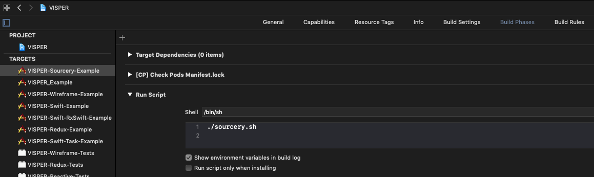

# VISPER-Sourcery

VISPER is a component based library, which helps you to develop modular apps based on the VIPER Pattern.

 VISPER-Sourcery supports you creating a VISPER application by creating the nessecary boilerplate code for you.

[](http://cocoapods.org/pods/VISPER)
[](http://cocoapods.org/pods/VISPER)
[](http://cocoapods.org/pods/VISPER)

## Getting started

Hint: if you have never heard of sourcery before see description at the end of this guide.

### Adding VISPER-Sourcery to your project/local machine

sourcery is a command line tool. This means that you need to have it installed on your local machine.  
You can choose brew or cocoapods or even compile it from source, but we will cover only brew and cocoapods in this guide.

*via brew* (needs to be done once)

via brew install sourcery like this

```bash
brew install sourcery
```

*via cocoapods* (needs to be done for each project)

Add `pod 'Sourcery'` to your `Podfile` and run `pod update Sourcery`. This will download the latest release binary and will put it in your project's CocoaPods path so you will run it with `$PODS_ROOT/Sourcery/bin/sourcery`

### Configuring sourcery (must be done for each project)

You can add scripts to Xcode that will be run before every build. You can make xcode run sourcery before every built process. Here is a screenshot where to place the script.



press + button to add run script.

The content of the file could look like this. *This only works, if the project file name matches the project directory name* This should be the case in 95% of all cases. In other cases you need to set $FOLDERNAME manually.

```bash
PROJECTFILE=$(ls -d ./*.xcodeproj/)
FOLDERNAME=(`basename $PROJECTFILE .xcodeproj`)
echo "found folder name $FOLDERNAME"
EXAMPLE_DIR="../Example"
MYSOURCES_DIR="../$FOLDERNAME/Classes"
MYPODS_DIR="$EXAMPLE_DIR/Pods"

echo "generating folders for sourcery if needed"
mkdir -p "../$FOLDERNAME/generatorhints"
mkdir -p "../$FOLDERNAME/templates"
mkdir -p "$MYSOURCES_DIR/generated"

echo "set folders for sourcery"
MARKER_DIR="../$FOLDERNAME/generatorhints"
STENCIL_TEMPLATES="../$FOLDERNAME/templates"
OUTPUT="$MYSOURCES_DIR/generated"

echo "Sources directory = '$MYSOURCES_DIR'"
echo "Pods directory ='$MYPODS_DIR'"
echo "Generatorhints ='$MARKER_DIR'"

sourcery --sources $MYPODS_DIR --sources $MARKER_DIR  --sources $MYSOURCES_DIR --templates $STENCIL_TEMPLATES --templates $MYPODS_DIR --output $OUTPUT --disableCache
```

What does that do? 

Tells sourcery
- where to look for source code
- where to look for stencil files
- where to save the generated sources
- *disable cache*

*Hint* Usually sourcery would update all the generated code after changes because it is run before every build. Sometimes it fails doing so. (You can tell for sure if the generated output is gibberish and contains unbalanced brackets.) A workaround is adding `--disableCache` to the sourcery call. If even this fails, you can safeley delete generated source code and have it regenerated.

The marker protocols and Extensions should not belong to a target as they are used by sourcery only. Remove them from target to avoid errors or warnings after creating them.
*The generated folders and their content might not be visible. Maybe you have to add them to project (add, not create!)*

### Quick Lookup for Target Membership settings

|  Target membership  | stencil files  | marker protocols  |  generated code | inLineCode  |
|---|---|---|---|---|
| no  |  x | x  |   |   |
|  project |   |   | x  | x  |

### Hint

There are two sorts of code generation. inLine Code is inserted in your Code, the other generated code gets saved to the 'generated` folder.

### WithAutoGeneralInitializers - Generating a default initializer for a struct

Assume the following: You have a struct and want specific initializers. VISPER-sourcery comes with a template that can generate convenience initializers.

Example struct

```swift
struct Person {
    var firstName: String
    var lastName: String
    var birthDate: Date
}
```

after adding `extension Person: WithAutoGeneralInitializers {}` to the generator hints, maybe a file called `Person+Extensions.swift` and running sourcery an extension will appear in `generated` folder.

```swift
extension Person {

    // stored properties of Person
    internal enum Properties: String {
        case firstName
        case lastName
        case birthDate
    }
    //init with object of same type
    internal init(sourceObject: Person) {
        self.init(
        firstName: sourceObject.firstName, 
        lastName: sourceObject.lastName, 
        birthDate: sourceObject.birthDate
        )
    }

    // init to modify one property value of a Person
    internal init?(sourceObject: Person, property: Properties, value: Any) {
    switch property {
    case .firstName:
    self.init(
    firstName:  (value as! String), 
    lastName: sourceObject.lastName, 
    birthDate: sourceObject.birthDate
    )
    case .lastName:
    self.init(
    firstName: sourceObject.firstName, 
    lastName:  (value as! String), 
    birthDate: sourceObject.birthDate
    )
    case .birthDate:
    self.init(
    firstName: sourceObject.firstName, 
    lastName: sourceObject.lastName, 
    birthDate:  (value as! Date)
    )
    }
}


// init to modify the value the property firstName of a Person
internal init?(sourceObject: Person, firstName: String) {
self.init(sourceObject: sourceObject,
property: .firstName,
value: firstName as Any) 
}

// init to modify the value the property lastName of a Person
internal init?(sourceObject: Person, lastName: String) {
self.init(sourceObject: sourceObject,
property: .lastName,
value: lastName as Any) 
}

// init to modify the value the property birthDate of a Person
internal init?(sourceObject: Person, birthDate: Date) {
self.init(sourceObject: sourceObject,
property: .birthDate,
value: birthDate as Any) 
}

}
}
```

**Hier erklärst du einmal konkret an einem Beispiel wie man WithAutoInitializer implementiert was er erzeugt und wo man es findet am besten du beginnst damit das Ziel zu Beschreiben (Ich habe ein struct und möchte das sein Konstruktor automatisch generiert wird).**

## What else can be automated by VISPER-Sourcery? 

### WithAutoGeneralInitializer - Convinience Initializers for property changes of a struct

Usually structs come with an auto generated initializer but if you want to have them generated stencil/sourcery-way, you can use the WithAutoGeneralInitializer marker protocol.

before conforming to WithAutoGeneralInitializer: 

```swift
struct Person {
    var firstName: String
    var lastName: String
    var birthDate: Date
}
```

after conforming to WithAutoGeneralInitializer and running sourcery:

```swift
struct Person {
    var firstName: String
    var lastName: String
    var birthDate: Date

    // sourcery:inline:auto:Person.GenerateInitializers
    // auto generated init function for Person
    internal init(firstName: String, lastName: String, birthDate: Date){
        self.firstName = firstName
        self.lastName = lastName
        self.birthDate = birthDate
    }
    // sourcery:end
}
```


**Hier erklärst du einmal konkret wie man WithAutoGeneralInitializer implementiert was er erzeugt und wo man es findet am besten du beginnst damit das Ziel zu beschreiben.**

### AutoAppReducer - AutoGenerating an AppReducer and an ApplicationFactory for a specific state 

**Hier erklärst du einmal konkret wie man AutoAppReducer implementiert was er erzeugt und wo man es findet am besten du beginnst damit das Ziel zu beschreiben.**

Generates an `ApplicationFactory` for any class that implements the `AutoAppReducer` marker protocol. This is usually implemented by the `AppState` and contains the (sub)states of the app. For every (sub)state the code for creating and adding a feature observer is auto generated.

### AutoReducer - Auto genereating convinience reducers for changing a property of an specific state.

**Hier erklärst du einmal konkret wie man AutoReducer implementiert was er erzeugt und wo man es findet am besten du beginnst damit das Ziel zu beschreiben.**

Autocreates Action and Reducer for any type that implements `AutoReducer`

# A short introduction how Sourcery works

VISPER-Sourcery uses the Sourcery-Commandline-Tool to generate Source Code that follows a certain pattern so that automating is possible. Existing classes/structs/enums can be modified (inLine). Extensions or even classes/structs/enums can be auto-created. If you don't know how sourcery works have a look at the following example or dive into it's own documentation [documentation](https://github.com/krzysztofzablocki/Sourcery).

An example suited for introduction might be the generation of `LogicFeature` with the `AutoReducer` marker protocol.

The following class was generated with the help of VISPER-Sourcery:

```swift
class AutoReducerFeature: LogicFeature {
    func injectReducers(container: ReducerContainer) {
        // AppState
        container.addReducer(reducer: AppStateSetStylestateReducer())
        container.addReducer(reducer: AppStateSetUserstateReducer())
        // StyleState
        container.addReducer(reducer: StyleStateSetBackgroundcolorReducer())
        container.addReducer(reducer: StyleStateSetFontcolorReducer())
        // UserState
        container.addReducer(reducer: UserStateSetFirstnameReducer())
        container.addReducer(reducer: UserStateSetLastnameReducer())
        container.addReducer(reducer: UserStateSetUsernameReducer())
        container.addReducer(reducer: UserStateSetEmailReducer())
    }
}
```

 To have something generated, you need a template, a marker protocol and something that conforms to the marker protocol. There is another way to have code generated inLine with comments but more on that later.
 `AutoReducer`  is a so called marker protocol. It is some sort of trick to mark a struct or class, in fact the protocols are empty.  

```swift
import Foundation
public protocol AutoReducer{}
```

struct that "conforms" to AutoReducer:   

```swift
import Foundation
import VISPER_Sourcery

struct StyleState: AutoReducer, Equatable {
    let backgroundColor: UIColor
    let fontColor: UIColor
}
```

The struct StyleState conforms to an empty protocol which is syntactically correct but senseless to the compiler. But it is not senseless to sourcery. Sourcery is a command line tool that can identify classes/strucs/enums by their marker protocol(s) and modifies or generates code by evaluating template files. Or as mentioned before: sourcery can add generated code inLine when special comments are used as well, but more on that later.

Hint: marker protocols in production will be mostly added like this:

```swift 
extension SomeClass: SomeMarkerProtocol {}
```

Let's have a look at a stencil file that comes with VISPER-Sourcery,  AutoReducerFeature.stencil:

```stencil
import VISPER_Swift
import VISPER_Redux
//
//
// Feature to add all auto generated reducers
//
//
class AutoReducerFeature: LogicFeature {
    func injectReducers(container: ReducerContainer) {
        
            // {{type.name}}
            
                container.addReducer(reducer: {{type.name}}Set{{property.name|capitalize}}Reducer())
            
        
    }
}
```

As you can see, there is a for loop that iterates over `types.implementing.AutoReducer` and a for loop iterating over `type.storedVariables`. Any type that "implements" the AutoReducer marker protocol is found by sourcery and the correspoding template(s) are processed. In this case there will as much addReducer(reducer:_)-methods added as properties are found per Type that conform to `AutoReducer`.

the methods  `container.addReducer(reducer: StyleStateSetFontcolorReducer())` and  `container.addReducer(reducer: StyleStateSetBackgroundcolorReducer())` were added, because StyleState conforms to the marker protocol `AutoReducer` and has the members `let backgroundColor: UIColor` and `let fontColor: UIColor`.

The other methods were generated accordingly - same stencil file, but conformance to the marker protocol in a struct somewhere else.

This is how marker Protocols work with templates in VISPER-Sourcery in general. The explanation was more detailed, the next explanations be less detailed.

VISPER-Sourcery uses the Stencil-Template-Engine, a more detailed and general explanation can be found [here](http://stencil.fuller.li/en/latest/templates.html "Stencil by Kyle Fuller")

---------------------------------------------------------------------------------------------------------

## Currently available VISPER-Components

* [VISPER](https://rawgit.com/barteljan/VISPER/master/docs/VISPER/index.html) - a convenience import wrapper to include all VISPER Components with one import. It contains some deprecated components for backwards compatibility to previous VISPER Versions.
* [VISPER-Swift](https://rawgit.com/barteljan/VISPER/master/docs/VISPER-Swift/index.html) - All swift components of the VISPER-Framework, and a convenience import wrapper for all their dependencies.
* [VISPER-Objc](https://rawgit.com/barteljan/VISPER/master/docs/VISPER-Objc/index.html) - A wrapper around the core VISPER classes to use them in an objc codebase.
* [VISPER-Core](https://rawgit.com/barteljan/VISPER/master/docs/VISPER-Core/index.html) - Some common core protocols used to communicate between the different components of your feature. This pod should be used if you want to include VISPER Components into your own projects and components. It's protocols are implemented in the other VISPER component pods.
* [VISPER-Wireframe](https://rawgit.com/barteljan/VISPER/master/docs/VISPER-Wireframe/index.html) - The component containing the implementation of the wireframe layer in a VIPER-Application, it manages the presentation and the lifecycle of your ViewControllers.
* VISPER-Presenter([swift](https://rawgit.com/barteljan/VISPER/master/docs/VISPER-Presenter/Swift/index.html) / [objc](https://rawgit.com/barteljan/VISPER/master/docs/VISPER-Presenter/Objc/index.html)) - The component containing the implementation of the presentation layer in a VIPER-Application. It contains some presenter classes to seperate your application logic, from your view logic. 
* [VISPER-Redux](https://rawgit.com/barteljan/VISPER/master/docs/VISPER-Redux/index.html) - A component containing the implementation of an redux architecture used in many VISPER-Application to represent the interactor layer in a viper application.
* [VISPER-Reactive](https://rawgit.com/barteljan/VISPER/master/docs/VISPER-Reactive/index.html) - A simple implementation of reactive properties to allow the use of a reactive redux architecture in a VISPER-Application. It can be updated by the subspec VISPER-Rective/RxSwift to use the RxSwift framework.
* [VISPER-Sourcery](https://rawgit.com/barteljan/VISPER/master/docs/VISPER-Sourcery/index.html) - A component supporting you to create a VISPER application by creating some nessecary boilerplate code for you.
* VISPER-UIViewController ([swift](https://rawgit.com/barteljan/VISPER/master/docs/VISPER-UIViewController/swift/index.html))  /  ([objc](https://rawgit.com/barteljan/VISPER/master/docs/VISPER-UIViewController/objc/index.html)) - A component extending UIViewControllers to notify a presenter about it's lifecycle (viewDidLoad, etc.) 
* [VISPER-Entity](https://rawgit.com/barteljan/VISPER/master/docs/VISPER-Entity/index.html) - A component modeling the entity layer if you do not use your custom layer in your VISPER-Application.
